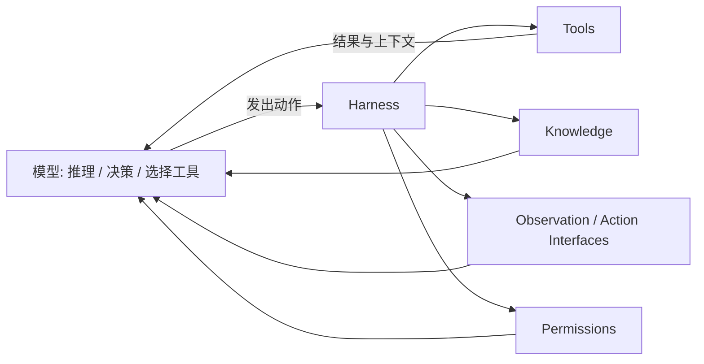
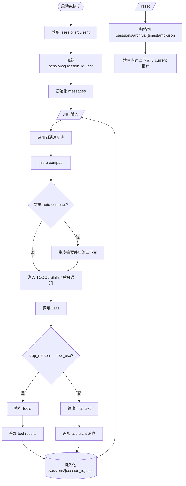

# nanoClaudeCode

用 Go 实现的 Coding Agent Harness，逐步还原 Claude Code 的核心机制。

---

## 核心理念

**Agent 是模型，不是框架。**

这个项目可以先从 3 层来理解：

- **模型层**：负责推理、决策、选择什么时候调用工具。
- **Harness 层**：负责提供工具、知识、观察/行动接口和权限边界。
- **运行时层**：在同一个 agent loop 上逐步叠加 TODO、Skills、子代理、会话持久化、上下文压缩、后台任务。



Agent 循环：



循环永远不变。每个课程只在循环之上叠加一个 harness 机制。

---

## 当前实现

### `demo/cmd/tool_use` — 带 TODO 状态管理的工具调用 Agent

核心特性：
- **4 个工具**：`bash`、`read_file`、`write_file`、`todo_set`
- **TODO 状态管理**：三阶段状态机（`empty` → `active` → `completed`），完整校验
- **上下文注入**：每轮请求自动将 TODO 状态注入 developer 消息
- **工具调度**：dispatch map（`toolName → handler`），循环结构不动，新工具注册即用
- **安全机制**：路径遍历防护、危险命令黑名单、文件大小限制、命令超时（30s）

### `cmd/agent` + `agents/runtime` — 父子代理 + Skills

核心特性：
- **子代理工具**：`subagent_spawn`、`subagent_wait`（并发上限 4，失败重试上限 2）
- **后台任务工具**：`bash_bg`、`bg_wait`、`bg_list`
- **后台完成通知**：每轮请求前自动注入已完成后台任务结果，避免模型漏看异步结果
- **父代理约束**：存在 pending 子代理时，父代理不能直接结束，必须先 `subagent_wait`
- **会话控制**：`/reset` 会清理上下文并取消未完成子代理
- **会话持久化**：每个会话保存为 `.sessions/<session_id>.json`，继续对话会持续写回同一文件
- **会话恢复**：支持 `/sessions`、`/resume`、`/resume <session_id>`
- **当前会话指针**：`.sessions/current` 记录当前激活会话
- **上下文压缩**：每轮 `micro compact`，超阈值自动摘要压缩
- **工具代码分层**：`agents/runtime/tools` 按类型拆分（base/todo/skills/subagent/schema/parser）
- **Skills（按需激活）**：`skill_list`、`skill_load`、`skill_unload`
- **技能来源**：运行目录 `.skills/`（支持 front matter：`name`、`description`）
- **模型配置**：子代理模型读取 `SUBAGENT_MODEL`（为空回退 `OPENAI_MODEL`）
- **后台任务当前边界**：暂未做后台任务持久化与重启恢复；进程重启后旧后台任务状态不会恢复

### `demo/cmd/chatbot` — 基础对话 Agent

- 多轮对话，保留最近 12 条历史
- 使用 Responses API string input 模式

---

## 路线图


| 课程 | 主题 | 格言 | 状态 |
|------|------|------|------|
| s01 | Agent 循环 | *One loop & Bash is all you need* | ✅ 已实现 |
| s02 | Tool Use | *加一个工具，只加一个 handler* | ✅ 已实现 |
| s03 | TodoWrite | *没有计划的 agent 走哪算哪* | ✅ 已实现 |
| s04 | 子智能体 | *大任务拆小，每个小任务干净的上下文* | ✅ 已实现 |
| s05 | Skills | *用到什么知识，临时加载什么知识* | ✅ 已实现 |
| s06 | Context Compact | *上下文总会满，要有办法腾地方* | ✅ 已实现 |
| s07 | 会话持久化 | *退出后还能恢复上下文，不丢历史* | ✅ 已实现 |
| s08 | 后台任务 | *慢操作丢后台，agent 继续想下一步* | ✅ 已实现 |
| s09 | 智能体团队 | *任务太大一个人干不完，要能分给队友* | 📋 待实现 |
| s10 | 团队协议 | *队友之间要有统一的沟通规矩* | 📋 待实现 |
| s11 | 自治智能体 | *队友自己看看板，有活就认领* | 📋 待实现 |
| s12 | Worktree 隔离 | *各干各的目录，互不干扰* | 📋 待实现 |

---

## 快速开始

### 环境配置

在项目根目录创建 `.env`（或在 `demo/.env` 中配置）：

```env
OPENAI_BASE_URL=https://api.anthropic.com/v1   # 或自定义 endpoint
OPENAI_API_KEY=your-api-key
OPENAI_MODEL=claude-sonnet-4-6
SUBAGENT_MODEL=claude-haiku-4-5                # 可选，默认回退 OPENAI_MODEL
DEBUG_HTTP=false
```

### 运行 Coding Agent

```sh
go run ./cmd/agent/main.go
```

父代理当前可用工具：

- 基础工具：`bash`、`read_file`、`write_file`、`todo_set`
- skills：`skill_list`、`skill_load`、`skill_unload`
- 子代理：`subagent_spawn`、`subagent_wait`
- 后台任务：`bash_bg`、`bg_wait`、`bg_list`

启动后可用命令：

- `/sessions`：列出已保存的会话 ID
- `/resume`：恢复当前会话指针指向的会话
- `/resume <session_id>`：恢复指定会话，并将其设为当前会话
- `/reset`：归档当前会话快照，清空内存上下文，并清除当前会话指针
- `/exit`：退出

---

## 依赖

```
github.com/openai/openai-go/v3   # OpenAI-compatible Go SDK（兼容 Responses API）
github.com/joho/godotenv         # .env 文件加载
```

---

## 目录结构

```
nanoClaudeCode/
├── README.md
├── go.mod / go.sum                # module: nanocc
├── cmd/
│   └── agent/                      # 统一入口：父子代理 + skills
├── agents/
│   ├── runtime/                    # 主运行时 loop + orchestration
│   │   └── tools/                  # 工具实现拆分（base/todo/skills/subagent 等）
│   ├── subagent/                   # 子代理并发管理器（库包）
│   ├── compact/                    # s06: 上下文压缩逻辑
│   ├── background/                 # s08: 后台任务管理
│   ├── sessions/                   # s07: 会话持久化与恢复
│   └── skills/                     # skills 注册/状态与 .skills 加载
├── demo/                          # 课程式主线实现（s01-s03）
│   ├── cmd/
│   │   ├── chatbot/               # s01: 基础 agent 循环（无工具）
│   │   └── tool_use/              # s01-s03: 工具调用 + TODO 管理
├── internal/common/               # 共享配置与 OpenAI client
├── docs/
    └── response-api.md            # Responses API 参考文档
```

## 参考

[learn-claude-code](https://github.com/shareAI-lab/learn-claude-code)

[claude-code](https://github.com/anthropics/claude-code)
