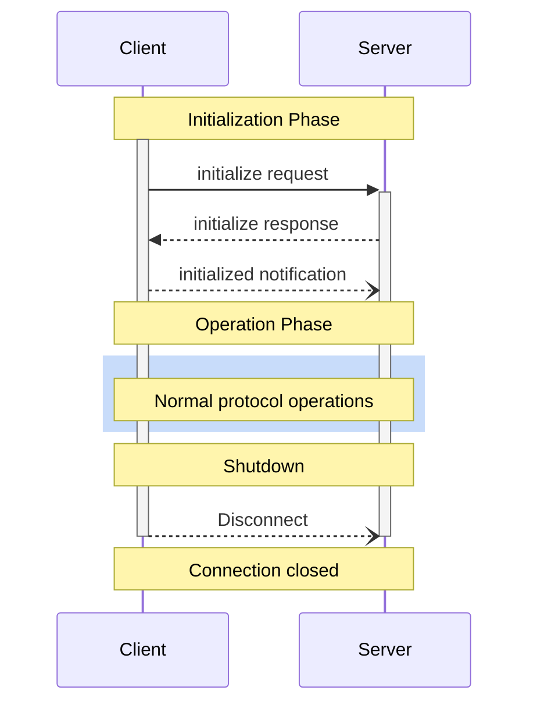
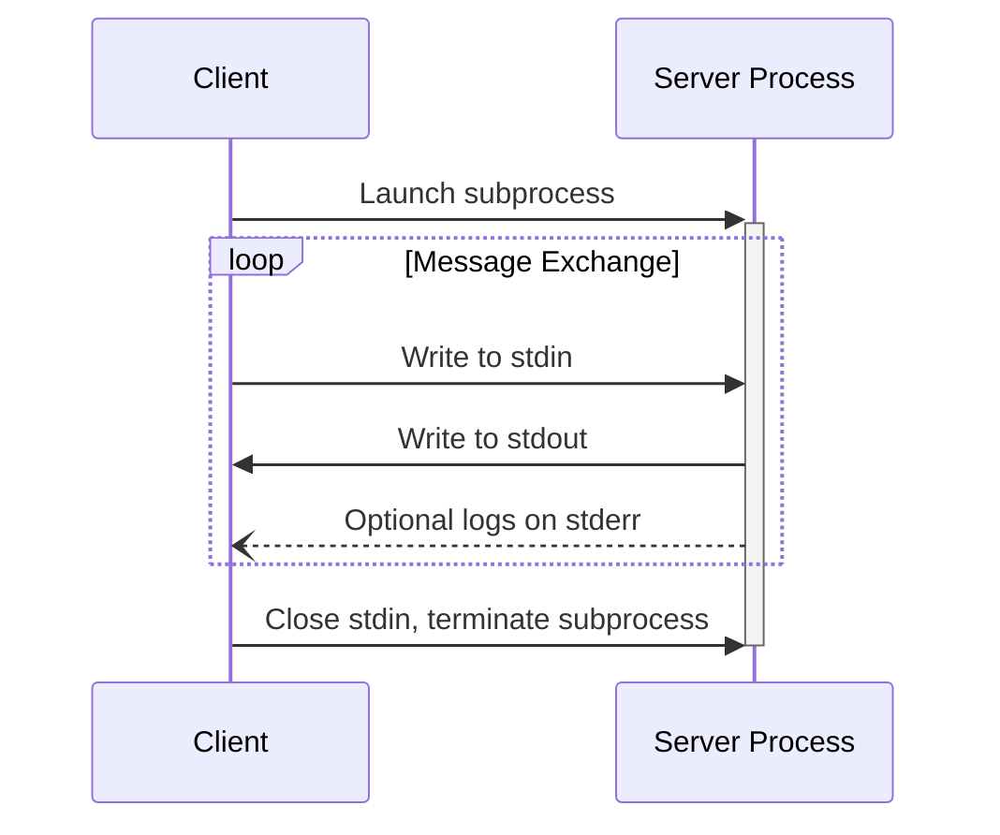

# MCP客户端实现指南

## 概述

MCP（Model Context Protocol）客户端是连接AI应用与外部系统的关键组件，负责与MCP服务器建立连接、协商能力并执行操作 [1](#1-0) 。

## 协议基础

### 核心架构
MCP采用三层架构：
- **MCP Host**: AI应用程序
- **MCP Client**: 连接器组件（你需要实现的部分）
- **MCP Server**: 提供功能的服务程序 [1](#1-0) 

### 消息格式
所有通信基于JSON-RPC 2.0规范 [2](#1-1) 。

### 生命周期管理
连接经历三个阶段：
1. **初始化**: 能力协商和协议版本确认
2. **操作**: 正常协议通信
3. **关闭**: 优雅终止连接 [3](#1-2) 

## 传输层选择

### Stdio传输
- 适用于本地进程间通信
- 性能最佳，无网络开销
- 客户端启动服务器作为子进程 [4](#1-3) 

### Streamable HTTP传输
- 适用于远程服务器连接
- 支持HTTP POST和Server-Sent Events
- 支持标准HTTP认证 [5](#1-4) 

## 客户端实现步骤

### 1. 初始化连接
```python
# Python示例
async def connect_to_server(self, server_script_path: str):
    is_python = server_script_path.endswith('.py')
    is_js = server_script_path.endswith('.js')
    command = "python" if is_python else "node"
    
    server_params = StdioServerParameters(
        command=command,
        args=[server_script_path],
        env=None
    )
    
    stdio_transport = await self.exit_stack.enter_async_context(stdio_client(server_params))
    self.stdio, self.write = stdio_transport
    self.session = await self.exit_stack.enter_async_context(ClientSession(self.stdio, self.write))
    
    await self.session.initialize()
``` [6](#1-5) 

### 2. 能力协商
客户端在初始化时声明支持的功能：
```json
{
  "jsonrpc": "2.0",
  "id": 1,
  "method": "initialize",
  "params": {
    "protocolVersion": "2025-11-25",
    "capabilities": {
      "roots": {"listChanged": true},
      "sampling": {},
      "elicitation": {"form": {}, "url": {}}
    },
    "clientInfo": {
      "name": "YourClient",
      "version": "1.0.0"
    }
  }
}
``` [7](#1-6) 

### 3. 工具发现和调用
```python
# 发现可用工具
response = await self.session.list_tools()
available_tools = [{
    "name": tool.name,
    "description": tool.description,
    "input_schema": tool.inputSchema
} for tool in response.tools]

# 调用工具
result = await self.session.call_tool(tool_name, arguments)
``` [8](#1-7) 

### 4. 资源访问
```python
# 列出资源
resources = await self.session.list_resources()

# 读取资源
resource_data = await self.session.read_resource(resource_uri)
```

## 完整客户端示例

### Java客户端
```java
// 创建同步客户端
McpSyncClient client = McpClient.sync(transport)
    .requestTimeout(Duration.ofSeconds(10))
    .capabilities(ClientCapabilities.builder()
        .roots(true)
        .sampling()
        .elicitation()
        .build())
    .build();

// 初始化连接
client.initialize();

// 列出工具
ListToolsResult tools = client.listTools();

// 调用工具
CallToolResult result = client.callTool(
    new CallToolRequest("calculator", Map.of("operation", "add", "a", 2, "b", 3))
);
``` [9](#1-8) 

### HTTP传输配置
```java
// Streamable HTTP传输
McpTransport transport = HttpClientStreamableHttpTransport
    .builder("http://your-mcp-server")
    .build();

// SSE传输
McpTransport transport = HttpClientSseClientTransport
    .builder("http://your-mcp-server")
    .build();
``` [10](#1-9) 

## 关键注意事项

### 安全考虑
- **用户同意**: 必须获得用户明确同意才能执行操作
- **工具安全**: 工具代表任意代码执行，需要谨慎处理
- **数据隐私**: 未经同意不得传输用户数据 [11](#1-10) 

### 技术要点
- **日志处理**: STDIO服务器切勿写入stdout，会破坏JSON-RPC消息
- **错误处理**: 实现健壮的错误处理和重连机制
- **资源管理**: 正确清理连接和会话资源 [12](#1-11) 

### 最佳实践
- 使用官方SDK确保协议兼容性
- 实现渐进式功能发现
- 提供清晰的权限控制界面
- 支持多种传输方式以适应不同场景

## Notes

- MCP协议版本当前为2025-11-25（draft版本）
- 官方提供Python、Java、TypeScript等多种语言SDK
- 社区维护了许多预构建的MCP服务器可直接使用
- 实现时建议参考官方示例代码和测试用例

Wiki pages you might want to explore:
- [Client Features (modelcontextprotocol/modelcontextprotocol)](/wiki/modelcontextprotocol/modelcontextprotocol#2.6)

Wiki pages you might want to explore:
- [Client Features (modelcontextprotocol/modelcontextprotocol)](/wiki/modelcontextprotocol/modelcontextprotocol#2.6)

### Citations

**File:** docs/docs/learn/architecture.mdx (L31-43)
```text
MCP follows a client-server architecture where an MCP host — an AI application like [Claude Code](https://www.anthropic.com/claude-code) or [Claude Desktop](https://www.claude.ai/download) — establishes connections to one or more MCP servers. The MCP host accomplishes this by creating one MCP client for each MCP server. Each MCP client maintains a dedicated connection with its corresponding MCP server.

Local MCP servers that use the STDIO transport typically serve a single MCP client, whereas remote MCP servers that use the Streamable HTTP transport will typically serve many MCP clients.

The key participants in the MCP architecture are:

- **MCP Host**: The AI application that coordinates and manages one or multiple MCP clients
- **MCP Client**: A component that maintains a connection to an MCP server and obtains context from an MCP server for the MCP host to use
- **MCP Server**: A program that provides context to MCP clients

**For example**: Visual Studio Code acts as an MCP host. When Visual Studio Code establishes a connection to an MCP server, such as the [Sentry MCP server](https://docs.sentry.io/product/sentry-mcp/), the Visual Studio Code runtime instantiates an MCP client object that maintains the connection to the Sentry MCP server.
When Visual Studio Code subsequently connects to another MCP server, such as the [local filesystem server](https://github.com/modelcontextprotocol/servers/tree/main/src/filesystem), the Visual Studio Code runtime instantiates an additional MCP client object to maintain this connection.

```

**File:** docs/specification/draft/basic/index.mdx (L29-31)
```text
All messages between MCP clients and servers **MUST** follow the
[JSON-RPC 2.0](https://www.jsonrpc.org/specification) specification. The protocol defines
these types of messages:
```

**File:** docs/specification/draft/basic/lifecycle.mdx (L9-36)
```text
The Model Context Protocol (MCP) defines a rigorous lifecycle for client-server
connections that ensures proper capability negotiation and state management.

1. **Initialization**: Capability negotiation and protocol version agreement
2. **Operation**: Normal protocol communication
3. **Shutdown**: Graceful termination of the connection


```

**File:** docs/specification/draft/basic/lifecycle.mdx (L55-98)
```text
```json
{
  "jsonrpc": "2.0",
  "id": 1,
  "method": "initialize",
  "params": {
    "protocolVersion": "2025-11-25",
    "capabilities": {
      "roots": {
        "listChanged": true
      },
      "sampling": {},
      "elicitation": {
        "form": {},
        "url": {}
      },
      "tasks": {
        "requests": {
          "elicitation": {
            "create": {}
          },
          "sampling": {
            "createMessage": {}
          }
        }
      }
    },
    "clientInfo": {
      "name": "ExampleClient",
      "title": "Example Client Display Name",
      "version": "1.0.0",
      "description": "An example MCP client application",
      "icons": [
        {
          "src": "https://example.com/icon.png",
          "mimeType": "image/png",
          "sizes": ["48x48"]
        }
      ],
      "websiteUrl": "https://example.com"
    }
  }
}
```
```

**File:** docs/specification/draft/basic/transports.mdx (L22-52)
```text
## stdio

In the **stdio** transport:

- The client launches the MCP server as a subprocess.
- The server reads JSON-RPC messages from its standard input (`stdin`) and sends messages
  to its standard output (`stdout`).
- Messages are individual JSON-RPC requests, notifications, or responses.
- Messages are delimited by newlines, and **MUST NOT** contain embedded newlines.
- The server **MAY** write UTF-8 strings to its standard error (`stderr`) for any
  logging purposes including informational, debug, and error messages.
- The client **MAY** capture, forward, or ignore the server's `stderr` output
  and **SHOULD NOT** assume `stderr` output indicates error conditions.
- The server **MUST NOT** write anything to its `stdout` that is not a valid MCP message.
- The client **MUST NOT** write anything to the server's `stdin` that is not a valid MCP
  message.


```

**File:** docs/specification/draft/basic/transports.mdx (L54-76)
```text
## Streamable HTTP

<Info>

This replaces the [HTTP+SSE
transport](/specification/2024-11-05/basic/transports#http-with-sse) from
protocol version 2024-11-05. See the [backwards compatibility](#backwards-compatibility)
guide below.

</Info>

In the **Streamable HTTP** transport, the server operates as an independent process that
can handle multiple client connections. This transport uses HTTP POST and GET requests.
Server can optionally make use of
[Server-Sent Events](https://en.wikipedia.org/wiki/Server-sent_events) (SSE) to stream
multiple server messages. This permits basic MCP servers, as well as more feature-rich
servers supporting streaming and server-to-client notifications and requests.

The server **MUST** provide a single HTTP endpoint path (hereafter referred to as the
**MCP endpoint**) that supports both POST and GET methods. For example, this could be a
URL like `https://example.com/mcp`.

#### Security Warning
```

**File:** docs/docs/develop/build-client.mdx (L128-156)
```text
async def connect_to_server(self, server_script_path: str):
    """Connect to an MCP server

    Args:
        server_script_path: Path to the server script (.py or .js)
    """
    is_python = server_script_path.endswith('.py')
    is_js = server_script_path.endswith('.js')
    if not (is_python or is_js):
        raise ValueError("Server script must be a .py or .js file")

    command = "python" if is_python else "node"
    server_params = StdioServerParameters(
        command=command,
        args=[server_script_path],
        env=None
    )

    stdio_transport = await self.exit_stack.enter_async_context(stdio_client(server_params))
    self.stdio, self.write = stdio_transport
    self.session = await self.exit_stack.enter_async_context(ClientSession(self.stdio, self.write))

    await self.session.initialize()

    # List available tools
    response = await self.session.list_tools()
    tools = response.tools
    print("\nConnected to server with tools:", [tool.name for tool in tools])
```
```

**File:** docs/docs/develop/build-client.mdx (L172-178)
```text
    response = await self.session.list_tools()
    available_tools = [{
        "name": tool.name,
        "description": tool.description,
        "input_schema": tool.inputSchema
    } for tool in response.tools]

```

**File:** docs/sdk/java/mcp-client.mdx (L43-72)
```text
```java
// Create a sync client with custom configuration
McpSyncClient client = McpClient.sync(transport)
    .requestTimeout(Duration.ofSeconds(10))
    .capabilities(ClientCapabilities.builder()
        .roots(true)      // Enable roots capability
        .sampling()       // Enable sampling capability
        .elicitation()    // Enable elicitation capability
        .build())
    .sampling(request -> CreateMessageResult.builder()...build())
    .elicitation(elicitRequest -> ElicitResult.builder()...build())
    .toolsChangeConsumer((List<McpSchema.Tool> tools) -> ...)
    .resourcesChangeConsumer((List<McpSchema.Resource> resources) -> ...)
    .promptsChangeConsumer((List<McpSchema.Prompt> prompts) -> ...)
    .loggingConsumer((LoggingMessageNotification logging) -> ...)
    .progressConsumer((ProgressNotification progress) -> ...)
    .build();

// Initialize connection
client.initialize();

// List available tools
ListToolsResult tools = client.listTools();

// Call a tool
CallToolResult result = client.callTool(
    new CallToolRequest("calculator",
        Map.of("operation", "add", "a", 2, "b", 3))
);

```

**File:** docs/sdk/java/mcp-client.mdx (L170-186)
```text
            <Tab title="Streamable-HTTP (HttpClient)">

                Framework agnostic (only using JDK APIs) Streamable-HTTP client transport
                ```java
                McpTransport transport = HttpClientStreamableHttpTransport
                                            .builder("http://your-mcp-server")
                                            .build();
                ```
            </Tab>
                <Tab title="SSE (HttpClient)">

                    Framework agnostic (only using JDK APIs) SSE client transport
                    ```java
                    McpTransport transport = HttpClientSseClientTransport
                                                .builder("http://your-mcp-server")
                                                .build();
                    ```
```
