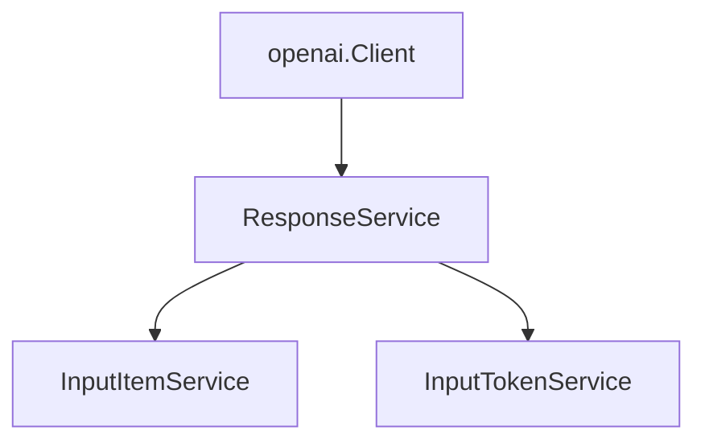

# Responses API 开发文档总结

## 核心概述

Responses API 是 OpenAI 的现代化接口，用于生成包含文本、图像或结构化输出的模型响应。它支持内联工具执行、托管提示变量，以及同步和流式响应模式。该 API 替代了已弃用的 Beta Assistants API，采用简化无状态或链接设计 [1](#0-0) 。

## 服务架构

Responses API 通过客户端层次结构中的 `ResponseService` 访问，包含管理输入项和令牌的子服务：



**核心方法**：
- `New()` - 创建同步响应 [2](#0-1) 
- `NewStreaming()` - 创建流式响应 [3](#0-2) 
- `Get()` - 检索响应
- `Delete()` - 删除响应
- `Cancel()` - 取消后台响应

## 响应生命周期

响应可以同步创建（返回完整 `Response` 对象）、异步流式创建（返回 `ssestream.Stream`）或作为后台作业（使用 `background: true` 参数） [4](#0-3) 。

## 基本使用示例

### 创建简单响应

```go
response, err := client.Responses.New(ctx, responses.ResponseNewParams{
    Model: shared.ResponsesModelGPT4o,
    Instructions: openai.String("你是一个有用的助手"),
    Inputs: []responses.ResponseInputItemUnionParam{
        responses.EasyInputMessageParam{
            Role:    responses.EasyInputMessageRoleUser,
            Content: responses.EasyInputMessageContentUnionParam{
                OfString: openai.String("你好，请介绍一下自己"),
            },
        },
    },
})
```

### 流式响应

```go
stream := client.Responses.NewStreaming(ctx, responses.ResponseNewParams{
    Model: shared.ResponsesModelGPT4o,
    Inputs: []responses.ResponseInputItemUnionParam{
        responses.EasyInputMessageParam{
            Role: responses.EasyInputMessageRoleUser,
            Content: responses.EasyInputMessageContentUnionParam{
                OfString: openai.String("讲一个故事"),
            },
        },
    },
})

for stream.Next() {
    event := stream.Current()
    switch e := event.AsAny().(type) {
    case responses.ResponseOutputTextDeltaEvent:
        fmt.Print(e.Delta)
    case responses.ResponseCompletedEvent:
        fmt.Printf("\n使用令牌数: %d\n", e.Response.Usage.TotalTokens)
    }
}
```

## 工具系统

Responses API 支持七种工具类型：

| 工具类型 | 用途 | 关键特性 |
|---------|------|---------|
| FunctionTool | 自定义函数调用 | JSON Schema 参数验证 [5](#0-4)  |
| FileSearchTool | 文件搜索 | 向量存储搜索 [6](#0-5)  |
| ComputerTool | 计算机控制 | UI 自动化 [7](#0-6)  |
| WebSearchTool | 网络搜索 | 互联网查询 [8](#0-7)  |
| MCPTool | 模型上下文协议 | 第三方集成 [9](#0-8)  |
| CodeInterpreterTool | Python 执行 | 代码解释器 [10](#0-9)  |
| CustomTool | 自定义工具 | 语法格式定义 [11](#0-10)  |

### 工具选择策略

```go
ToolChoice: responses.ResponseNewParamsToolChoiceUnion{
    OfToolChoiceMode: openai.Opt(responses.ToolChoiceOptionsAuto), // 自动选择
    // 或使用其他选项：
    // OfToolChoiceMode: openai.Opt(responses.ToolChoiceOptionsRequired), // 必须使用工具
    // OfToolChoiceMode: openai.Opt(responses.ToolChoiceOptionsNone), // 禁用工具
}
```

## 响应配置

### 输出格式控制

```go
Text: responses.ResponseTextConfigParam{
    Format: responses.ResponseFormatTextConfigUnionParam{
        OfJSONSchema: &responses.ResponseFormatTextJSONSchemaConfigParam{
            JSONSchema: shared.ResponseFormatJSONSchemaParam{
                Name:        "weather_response",
                Description: openai.String("天气响应格式"),
                Schema:      schemaObject,
                Strict:      openai.Bool(true),
            },
            Type: constant.JSONSchema,
        },
    },
}
```

### 推理配置

```go
Reasoning: shared.ReasoningParam{
    Effort:        shared.ReasoningEffortMedium, // low/medium/high
    GenerateSummary: shared.ReasoningGenerateSummaryAuto,
    Summary:       shared.ReasoningSummaryAuto,
}
```

## 输入管理

### 链接响应

使用 `previous_response_id` 维护对话上下文：

```go
params := responses.ResponseNewParams{
    Model:              shared.ResponsesModelGPT4o,
    PreviousResponseID: openai.String("resp_abc123"), // 从前一个响应继续
    Inputs: []responses.ResponseInputItemUnionParam{
        responses.EasyInputMessageParam{
            Role:    responses.EasyInputMessageRoleUser,
            Content: responses.EasyInputMessageContentUnionParam{
                OfString: openai.String("后续问题"),
            },
        },
    },
}
```

### 令牌计数

```go
count, err := client.Responses.InputTokens.Count(ctx, "resp_abc123")
fmt.Printf("输入令牌数: %d\n", count.TokenCount)
```

## 存储和后台执行

```go
params := responses.ResponseNewParams{
    Store:      openai.Bool(true),  // 持久化响应
    Background: openai.Bool(true),  // 后台执行
    // ... 其他参数
}
```

后台响应立即返回状态为 `queued` 或 `in_progress`，可以使用 `Get()` 轮询或 `GetStreaming()` 流式监控进度 [12](#0-11) 。

## 错误处理

```go
response, err := client.Responses.New(ctx, params)
if err != nil {
    var apierr *openai.Error
    if errors.As(err, &apierr) {
        log.Printf("HTTP %d", apierr.StatusCode)
        log.Println(string(apierr.DumpRequest(true)))
        log.Println(string(apierr.DumpResponse(true)))
    }
    return fmt.Errorf("响应创建失败: %w", err)
}
```

## 与 Chat Completions API 对比

| 特性 | Chat Completions API | Responses API |
|------|---------------------|---------------|
| 架构 | 无状态请求 | 无状态或可链接 |
| 工具执行 | 客户端处理 | 内联执行 |
| 提示管理 | 原始消息 | 托管提示版本控制 |
| 后台处理 | 不支持 | 支持 |
| 推荐状态 | 成熟稳定 | 新项目推荐 [13](#0-12)  |

## 最佳实践

1. **新项目推荐使用 Responses API** - 它提供更现代的功能和更简化的架构
2. **合理使用工具选择策略** - 根据需求选择 `auto`、`required` 或 `none`
3. **启用存储** - 如需后续检索，设置 `store: true`
4. **流式处理长响应** - 使用 `NewStreaming()` 提升用户体验
5. **错误处理** - 始终检查和处理 API 错误
6. **令牌管理** - 使用 `InputTokens.Count()` 预估成本

## Notes

- Responses API 是 OpenAI 推荐的新项目首选 API
- 支持七种工具类型，相比 Chat Completions API 的两种工具有显著扩展
- 提供后台执行功能，适合长时间运行的任务
- 支持响应链接，便于构建多轮对话
- 完整的错误处理和重试机制确保应用稳定性

Wiki pages you might want to explore:
- [Chat Completions API (openai/openai-go)](/wiki/openai/openai-go#3)
- [Responses API (openai/openai-go)](/wiki/openai/openai-go#4)
